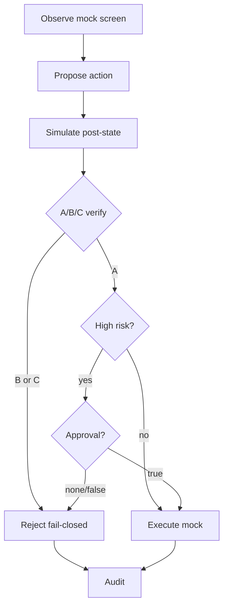

# GUI Safe Action

```mermaid
flowchart TD
    O[Observe mock screen] --> P[Propose action]
    P --> SIM[Simulate post-state]
    SIM --> V{A/B/C verify}
    V -->|A| AP{High risk?}
    V -->|B or C| DENY[Reject fail-closed]
    AP -->|yes| G{Approval?}
    AP -->|no| X[Execute mock]
    G -->|true| X
    G -->|none/false| DENY
    DENY --> AUD[Audit]
    X --> AUD
```
