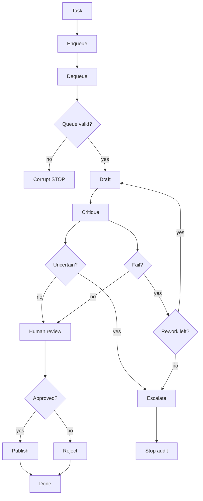

# Review Queue Workflow

```mermaid
flowchart TD
    T[Task] --> Q[Enqueue]
    Q --> D[Dequeue]
    D --> QC{Queue valid?}
    QC -->|no| COR[Corrupt STOP]
    QC -->|yes| W[Draft]
    W --> C[Critique]
    C --> U{Uncertain?}
    U -->|yes| E[Escalate]
    C --> F{Fail?}
    F -->|yes| RW{Rework left?}
    RW -->|yes| W
    RW -->|no| E
    U -->|no| H[Human review]
    F -->|no| H
    H --> A{Approved?}
    A -->|yes| P[Publish]
    A -->|no| R[Reject]
    E --> S[Stop audit]
    P --> X[Done]
    R --> X
```
