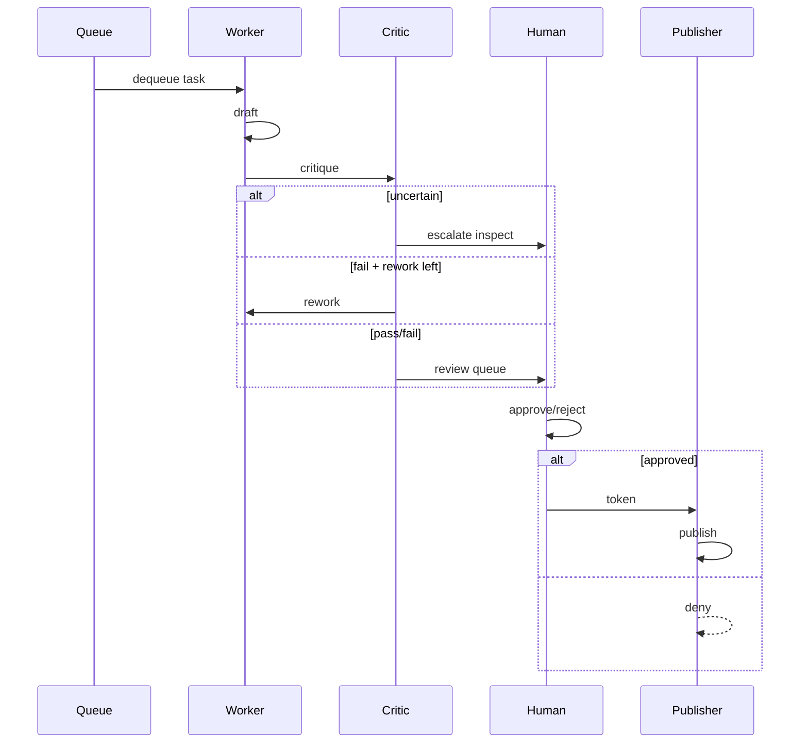

# Review Queue — Sequence

See [../diagrams/review-queue-workflow.md](../diagrams/review-queue-workflow.md)

```mermaid
sequenceDiagram
    participant Q as Queue
    participant W as Worker
    participant C as Critic
    participant H as Human
    participant P as Publisher

    Q->>W: dequeue task
    W->>W: draft
    W->>C: critique
    alt uncertain
        C->>H: escalate inspect
    else fail + rework left
        C->>W: rework
    else pass/fail
        C->>H: review queue
    end
    H->>H: approve/reject
    alt approved
        H->>P: token
        P->>P: publish
    else
        P-->>P: deny
    end
```
