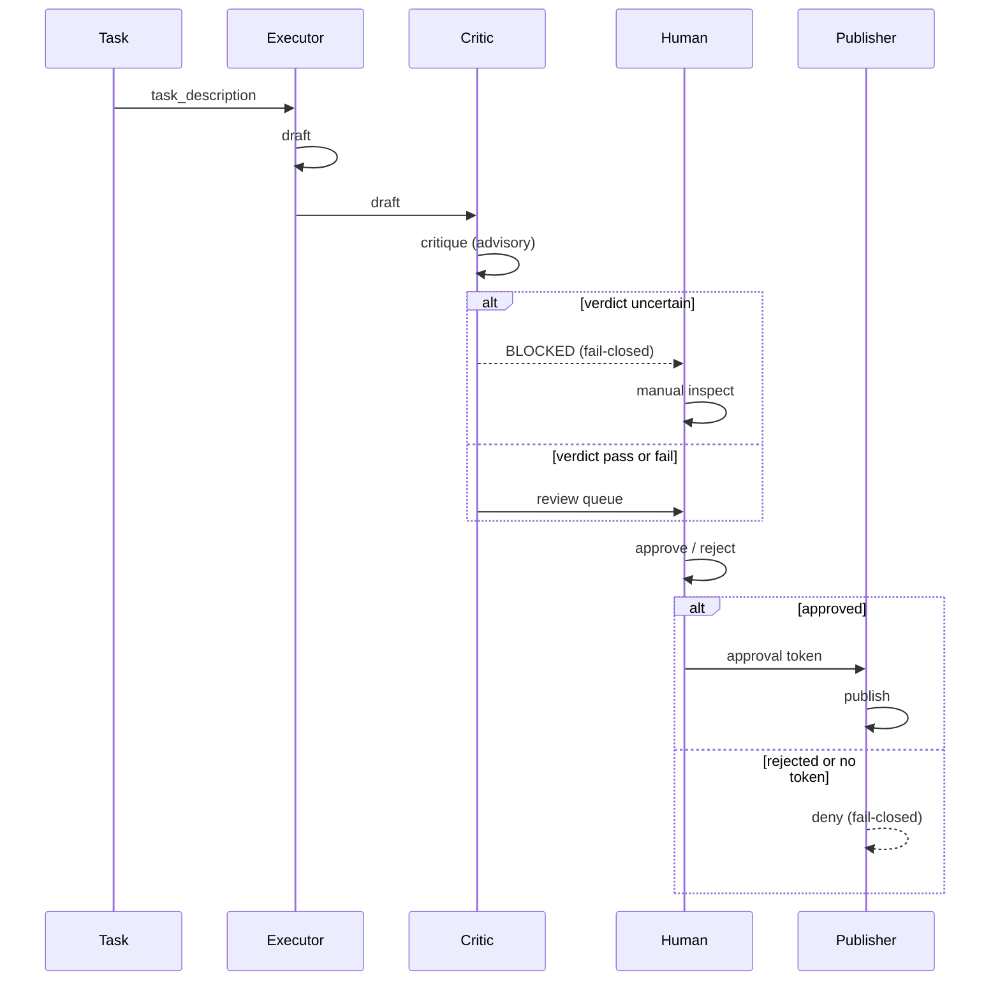

# Review Loop — Sequence Diagram

See also: [../diagrams/review-loop.md](../diagrams/review-loop.md)

```mermaid
sequenceDiagram
    participant T as Task
    participant E as Executor
    participant C as Critic
    participant H as Human
    participant P as Publisher

    T->>E: task_description
    E->>E: draft
    E->>C: draft
    C->>C: critique (advisory)
    alt verdict uncertain
        C-->>H: BLOCKED (fail-closed)
        H->>H: manual inspect
    else verdict pass or fail
        C->>H: review queue
    end
    H->>H: approve / reject
    alt approved
        H->>P: approval token
        P->>P: publish
    else rejected or no token
        P-->>P: deny (fail-closed)
    end
```
